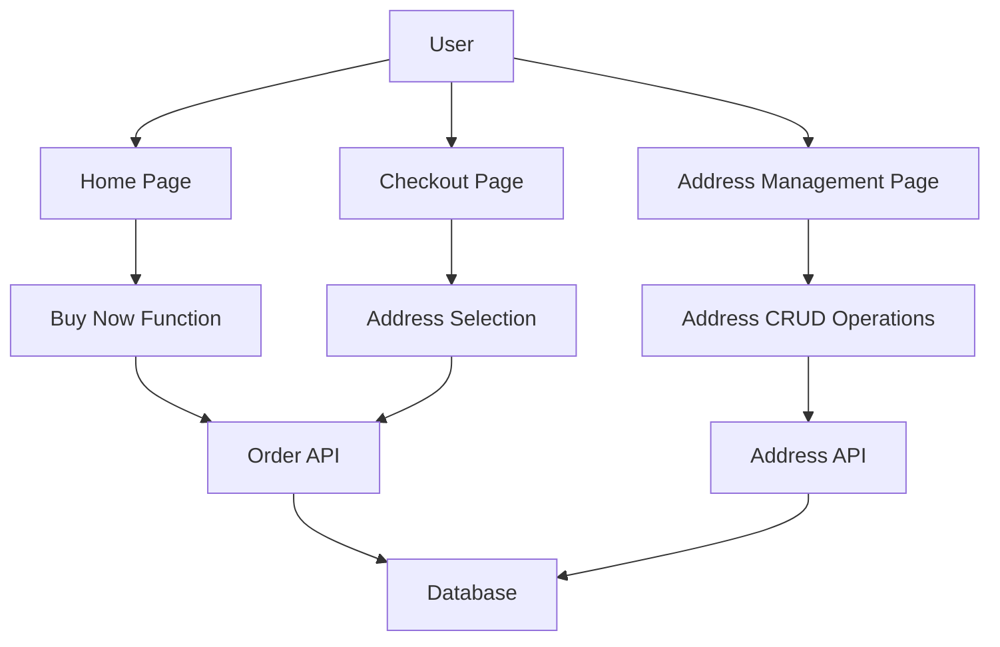

# Checkout Address Pre-configuration and Buy Now Function Clarification

## Overview

This document clarifies two important features in the MimiProgram e-commerce system:

1. **Checkout Address Pre-configuration**: The ability to maintain shipping addresses in advance for selection during checkout instead of requiring manual entry each time
2. **Buy Now Function**: A quick purchase feature that allows users to purchase products directly without adding them to the cart first

## Current Implementation Analysis

### Checkout Address Handling

Currently, the checkout process requires users to manually enter their shipping address information each time they place an order. The address fields include:
- Full Name
- Phone Number
- Address
- City
- Postal Code

This information is collected on the checkout page (`pages/checkout/checkout.js`) and stored with each order in the database. There is no existing functionality to save or pre-configure addresses for reuse.

### Buy Now Function

The "Buy Now" functionality exists in the system but may not be working as expected. The feature is implemented in the home page (`pages/home/home.js`) with the following characteristics:

1. **UI Implementation**: A "Buy Now" button is present on product cards in the home page
2. **Function Name**: `onQuickOrder` in `pages/home/home.js`
3. **Current Behavior**: 
   - Creates an order directly with a hardcoded shipping address
   - Processes payment immediately
   - Redirects to the orders page upon success

However, the implementation has limitations:
- Uses hardcoded shipping address information instead of user-specific addresses
- Doesn't integrate with any address management system
- May not properly handle user authentication or address validation

## Proposed Enhancements

### 1. Address Pre-configuration Feature

#### Feature Requirements
- Users should be able to save multiple shipping addresses
- Addresses should be associated with user accounts
- During checkout, users should be able to select from their saved addresses
- Users should be able to edit or delete saved addresses
- A default address option should be available

#### Technical Implementation Plan

**Backend Changes:**
1. Create a new `user_addresses` collection/table to store user address information
2. Add API endpoints:
   - `GET /api/user/addresses` - Retrieve all addresses for a user
   - `POST /api/user/addresses` - Add a new address
   - `PUT /api/user/addresses/:id` - Update an existing address
   - `DELETE /api/user/addresses/:id` - Delete an address
   - `PUT /api/user/addresses/:id/default` - Set an address as default

**Frontend Changes:**
1. Create a new "Address Management" page
2. Modify the checkout page to:
   - Fetch user's saved addresses
   - Display a dropdown or list of addresses to select from
   - Allow manual entry as fallback
   - Save the selected address with the order

#### Data Model
```
UserAddress {
  id: string,
  userId: string,
  name: string,
  phone: string,
  address: string,
  city: string,
  postalCode: string,
  isDefault: boolean,
  createdAt: date,
  updatedAt: date
}
```

### 2. Buy Now Function Enhancement

#### Current Issues
1. Hardcoded shipping address data
2. No integration with user address management
3. No proper error handling for various scenarios

#### Enhancement Plan
1. Modify the `onQuickOrder` function to:
   - Fetch user's default address or prompt for address selection
   - Use real user data instead of hardcoded values
   - Improve error handling and user feedback
2. Ensure the feature works seamlessly with the new address management system

## Implementation Architecture

### Component Diagram



### Data Flow

1. **Address Management Flow:**
   - User navigates to Address Management page
   - Page fetches user's addresses via Address API
   - User performs CRUD operations on addresses
   - Changes are persisted to database

2. **Checkout Flow:**
   - User proceeds to checkout
   - Page fetches user's saved addresses
   - User selects an address or enters a new one
   - Address is included in order creation request

3. **Buy Now Flow:**
   - User clicks "Buy Now" on a product
   - System fetches user's default address
   - Order is created directly with selected product and address
   - Payment is processed immediately

## API Endpoints

### New Address Management Endpoints

| Method | Endpoint | Description |
|--------|----------|-------------|
| GET | `/api/user/addresses` | Get all addresses for current user |
| POST | `/api/user/addresses` | Create a new address |
| PUT | `/api/user/addresses/:id` | Update an existing address |
| DELETE | `/api/user/addresses/:id` | Delete an address |
| PUT | `/api/user/addresses/:id/default` | Set address as default |

### Request/Response Examples

**Get User Addresses**
```
GET /api/user/addresses
Response:
{
  "data": [
    {
      "id": "1",
      "userId": "1",
      "name": "John Doe",
      "phone": "1234567890",
      "address": "123 Main St",
      "city": "New York",
      "postalCode": "10001",
      "isDefault": true,
      "createdAt": "2023-01-01T00:00:00.000Z",
      "updatedAt": "2023-01-01T00:00:00.000Z"
    }
  ]
}
```

**Create Address**
```
POST /api/user/addresses
Request:
{
  "name": "John Doe",
  "phone": "1234567890",
  "address": "123 Main St",
  "city": "New York",
  "postalCode": "10001",
  "isDefault": true
}
Response:
{
  "message": "Address created successfully",
  "data": {
    "id": "2",
    "userId": "1",
    "name": "John Doe",
    "phone": "1234567890",
    "address": "123 Main St",
    "city": "New York",
    "postalCode": "10001",
    "isDefault": true,
    "createdAt": "2023-01-02T00:00:00.000Z",
    "updatedAt": "2023-01-02T00:00:00.000Z"
  }
}
```

## Frontend Component Changes

### New Address Management Page
- Display list of saved addresses
- Form for adding/editing addresses
- Set default address functionality
- Delete address capability

### Modified Checkout Page
- Address selection dropdown instead of manual entry
- Option to add new address during checkout
- Prefill with default address when available

### Enhanced Buy Now Function
- Integration with address management
- Better error handling
- Improved user feedback

## Database Schema Changes

### For File-based Database (db.json)
Add a new `userAddresses` array:
```json
"userAddresses": [
  {
    "id": "1",
    "userId": "1",
    "name": "John Doe",
    "phone": "1234567890",
    "address": "123 Main St",
    "city": "New York",
    "postalCode": "10001",
    "isDefault": true,
    "createdAt": "2023-01-01T00:00:00.000Z",
    "updatedAt": "2023-01-01T00:00:00.000Z"
  }
]
```

### For MySQL Database
Add a new `user_addresses` table:
```sql
CREATE TABLE user_addresses (
  id INT AUTO_INCREMENT PRIMARY KEY,
  user_id INT NOT NULL,
  name VARCHAR(255) NOT NULL,
  phone VARCHAR(20) NOT NULL,
  address VARCHAR(255) NOT NULL,
  city VARCHAR(100) NOT NULL,
  postal_code VARCHAR(20) NOT NULL,
  is_default BOOLEAN DEFAULT FALSE,
  created_at TIMESTAMP DEFAULT CURRENT_TIMESTAMP,
  updated_at TIMESTAMP DEFAULT CURRENT_TIMESTAMP ON UPDATE CURRENT_TIMESTAMP,
  FOREIGN KEY (user_id) REFERENCES users(id)
);
```

## Security Considerations

1. All address management endpoints must require user authentication
2. Users should only be able to access/modify their own addresses
3. Input validation must be implemented for all address fields
4. Proper error handling to prevent information leakage

## Testing Plan

### Unit Tests
1. Address API endpoint tests
2. Address model validation tests
3. Frontend component tests for address management
4. Integration tests for checkout with address selection

### Manual Testing
1. Create, read, update, delete address operations
2. Set default address functionality
3. Checkout flow with address selection
4. Buy Now flow with address integration

## Future Enhancements

1. Address validation using postal service APIs
2. International address support
3. Address autocomplete functionality
4. Integration with map services for address selection