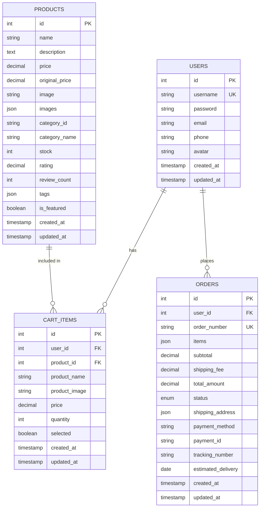
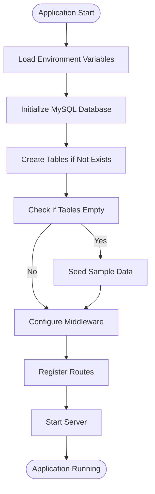

# Database Migration to MySQL and Cloud Development Support for WeChat Mini-Program

## 1. Overview

This document outlines the implementation plan for two key requirements:
1. Migrating the application's database from file-based storage to MySQL
2. Adding support for WeChat Cloud Development for users without their own servers

The current application supports multiple database implementations through a modular architecture that allows switching between file-based, MySQL, and planned WeChat Cloud Development backends.

## 2. Architecture

### 2.1 Current Architecture

The application follows a modular architecture with separate directories for different database implementations:

```
backend/
├── config/
│   └── dbConfig.js              # Database configuration
├── controllers/
│   ├── authController.js        # File-based controllers
│   ├── productsController.js
│   ├── cartController.js
│   ├── ordersController.js
│   └── mysql/                   # MySQL controllers
│       ├── authController.js
│       ├── productsController.js
│       ├── cartController.js
│       └── ordersController.js
├── models/
│   ├── User.js                  # File-based models
│   ├── Product.js
│   ├── CartItem.js
│   ├── Order.js
│   └── mysql/                   # MySQL models
│       ├── User.js
│       ├── Product.js
│       ├── CartItem.js
│       └── Order.js
├── routes/
│   ├── auth.js                  # File-based routes
│   ├── products.js
│   ├── cart.js
│   ├── orders.js
│   └── mysql/                   # MySQL routes
│       ├── auth.js
│       ├── products.js
│       ├── cart.js
│       └── orders.js
├── utils/
│   ├── db.js                   # File-based database utilities
│   ├── mysql.js                # MySQL database utilities
│   └── wechat.js               # WeChat utilities
├── middleware/
│   └── auth.js
├── scripts/
│   ├── initDB.js
│   └── initMySQLDB.js
├── server.js                   # Main server file
├── server-mysql.js             # MySQL server file (alternative)
└── .env                        # Environment configuration
```

### 2.2 Database Switching Mechanism

The application uses an environment variable `DB_TYPE` to determine which database implementation to use:
- `DB_TYPE=file` for file-based database (default)
- `DB_TYPE=mysql` for MySQL database
- `DB_TYPE=wechat` for WeChat Cloud Development (planned)

## 3. MySQL Migration Implementation

### 3.1 Prerequisites

1. Install MySQL server (version 5.7 or higher)
2. Create a MySQL database named `online_store`
3. Update the database configuration in the `.env` file

### 3.2 Configuration

Update the `.env` file with your MySQL configuration:

```env
DB_TYPE=mysql
MYSQL_HOST=localhost
MYSQL_USER=your_mysql_username
MYSQL_PASSWORD=your_mysql_password
MYSQL_DATABASE=online_store
```

### 3.3 Database Schema

The MySQL implementation includes four main tables with appropriate relationships:



### 3.4 Initialization Process

The database initialization process follows this sequence:
1. Load environment variables
2. Initialize MySQL database connection
3. Create database tables (if they don't exist)
4. Seed sample data (if tables are empty)
5. Configure Express middleware
6. Register MySQL routes
7. Start listening on the specified port



### 3.5 Migration Steps

1. **Backup existing data**: Export data from the file-based database
2. **Set up MySQL environment**: Install MySQL and create the database
3. **Update configuration**: Modify the `.env` file with MySQL settings
4. **Initialize MySQL database**: Run the initialization script
5. **Migrate data**: Transfer data from JSON files to MySQL tables
6. **Update server entry point**: Use `server-mysql.js` instead of `server.js`
7. **Test application**: Verify all functionality works correctly

### 3.6 Running with MySQL

```bash
# Install dependencies
npm install

# Update .env with MySQL configuration
# DB_TYPE=mysql

# Initialize database
npm run init-mysql-db

# Start server
npm start
```

## 4. WeChat Cloud Development Implementation

### 4.1 Prerequisites

1. Register as a WeChat Mini-Program developer
2. Enable Cloud Development in your WeChat Mini-Program
3. Install WeChat DevTools

### 4.2 Implementation Steps

1. **Update project configuration**:
   - In `project.config.json`, enable cloud development
   - Set up cloud environment ID

2. **Create cloud functions**:
   - Create cloud functions for each API endpoint
   - Move business logic from Express controllers to cloud functions

3. **Use cloud database**:
   - Replace MySQL/file database with WeChat Cloud Database
   - Update data models to use cloud database syntax

4. **Update API calls**:
   - Replace HTTP API calls with cloud function calls
   - Update frontend to use `wx.cloud` API

### 4.3 Cloud Function Structure

```
cloudfunctions/
├── login/
│   ├── index.js
│   └── package.json
├── getProducts/
│   ├── index.js
│   └── package.json
├── addToCart/
│   ├── index.js
│   └── package.json
└── createOrder/
    ├── index.js
    └── package.json
```

### 4.4 Example Cloud Function (login)

```javascript
// cloudfunctions/login/index.js
const cloud = require('wx-server-sdk')
cloud.init({
  env: cloud.DYNAMIC_CURRENT_ENV
})

const db = cloud.database()

exports.main = async (event, context) => {
  const wxContext = cloud.getWXContext()
  
  // Check if user exists
  const userResult = await db.collection('users').where({
    openid: wxContext.OPENID
  }).get()
  
  if (userResult.data.length > 0) {
    // User exists, return user info
    return {
      success: true,
      user: userResult.data[0]
    }
  } else {
    // Create new user
    const newUser = {
      openid: wxContext.OPENID,
      nickname: event.nickname,
      avatarUrl: event.avatarUrl,
      createdAt: new Date()
    }
    
    const createResult = await db.collection('users').add({
      data: newUser
    })
    
    return {
      success: true,
      user: {
        _id: createResult._id,
        ...newUser
      }
    }
  }
}
```

### 4.5 Frontend Integration

```javascript
// In your Mini-Program pages
wx.cloud.callFunction({
  name: 'login',
  data: {
    nickname: 'John Doe',
    avatarUrl: 'https://example.com/avatar.jpg'
  },
  success: res => {
    console.log('Login success', res.result)
  },
  fail: err => {
    console.error('Login failed', err)
  }
})
```

### 4.6 Migration from Traditional Backend

Migrating from the current Express.js backend to WeChat Cloud Development involves several key steps:


## 5. API Endpoints Reference

All endpoints are the same regardless of database implementation:

### Authentication
- `POST /api/auth/register` - Register a new user
- `POST /api/auth/login` - Login with username/password

### Products
- `GET /api/products` - Get all products (with filtering)
- `GET /api/products/:id` - Get product by ID
- `GET /api/products/categories` - Get product categories

### Cart
- `GET /api/cart` - Get user's cart items
- `POST /api/cart` - Add item to cart
- `PUT /api/cart/:id` - Update cart item
- `DELETE /api/cart/:id` - Remove item from cart

### Orders
- `GET /api/orders` - Get user's orders
- `GET /api/orders/:id` - Get order by ID
- `POST /api/orders` - Create a new order
- `POST /api/orders/:id/payment` - Process payment for order
- `PUT /api/orders/:id/status` - Update order status
- `GET /api/orders/:id/tracking` - Get logistics tracking info

## 6. Testing

### Testing MySQL Implementation

1. Verify database connection with provided credentials
2. Test table creation and seeding
3. Validate CRUD operations for all models
4. Test API endpoints with MySQL backend

### Testing WeChat Cloud Development

1. Deploy cloud functions to WeChat Cloud
2. Test cloud database operations
3. Verify frontend integration with cloud functions
4. Test authentication flow with WeChat Cloud

## 7. Security Considerations

### MySQL Security
- Use environment variables for database credentials
- Implement proper connection pooling
- Use parameterized queries to prevent SQL injection
- Apply appropriate user permissions in MySQL

### WeChat Cloud Development Security
- Never store sensitive credentials in client-side code
- Use environment variables for credentials in cloud functions
- Implement proper signature verification for WeChat API responses
- Use HTTPS for all communications

## 8. Performance Optimization

### MySQL Optimization
- Connection pooling with appropriate limits
- Parameterized queries for query plan caching
- Proper indexing strategy for common query patterns
- Regular database maintenance

### WeChat Cloud Development Optimization
- Optimize cloud function execution time
- Minimize data transfer between frontend and cloud functions
- Use cloud database indexes for frequently queried fields
- Implement caching where appropriate