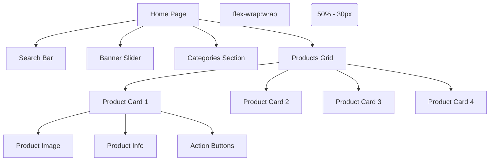

# Main Interface Optimization Design

## Overview
This document outlines the design for optimizing the main interface of the WeChat Mini Program. The current implementation has issues with image display, product layout, and cart functionality. The goal is to fix image loading problems, implement a two-product-per-row layout, and ensure the "Add to Cart" functionality works correctly.

## Current Issues
1. Images are not displaying properly on the main interface
2. Product cards are displayed in a single column layout
3. Layout appears disorganized and doesn't make efficient use of screen space
4. "Add to Cart" functionality doesn't persist items in the cart database
5. Cart page doesn't reflect items added from the home page

## Proposed Solution

### 1. Fix Image Display Issues
The current implementation references images that exist in the `/images` directory but may not be loading correctly due to:
- Incorrect image paths
- Improper image mode attributes
- Missing fallback handling for image loading failures

### 2. Implement Two-Product-Per-Row Layout
Change the product display layout from a single column to a two-column grid layout to:
- Better utilize screen space
- Improve visual appeal
- Enhance user browsing experience

## Technical Implementation

### 1. Update WXML Structure
Modify `pages/home/home.wxml` to implement the grid layout:

```xml
<!-- Update the products container section -->
<view class="section-title">
  <text>Featured Products</text>
</view>
<view class="products-grid">
  <view 
    class="product-card" 
    wx:for="{{featuredProducts}}" 
    wx:key="id"
  >
    <view bindtap="onViewProduct" data-product="{{item}}">
      <image 
        class="product-image" 
        src="{{item.image}}" 
        mode="aspectFill"
        binderror="onImageError"
        data-product-id="{{item.id}}"
      />
      <view class="product-info">
        <text class="product-name">{{item.name}}</text>
        <view class="product-price-container">
          <text class="product-price">${{item.price}}</text>
          <text class="product-original-price">${{item.originalPrice}}</text>
        </view>
        <view class="product-rating">
          <text class="rating-stars">★</text>
          <text class="rating-text">{{item.rating}} ({{item.reviewCount}})</text>
        </view>
      </view>
    </view>
    <view class="product-actions">
      <button class="action-button add-cart-btn" bindtap="onAddToCart" data-product="{{item}}">Add to Cart</button>
      <button class="action-button buy-now-btn" bindtap="onQuickOrder" data-product="{{item}}">Buy Now</button>
    </view>
  </view>
</view>
```

### 2. Update WXSS Styles
Modify `pages/home/home.wxss` to implement the two-column grid layout:

```css
/* Update products container styles */
.products-grid {
  display: flex;
  flex-wrap: wrap;
  padding: 0 20rpx;
  gap: 20rpx;
}

.product-card {
  flex: 1;
  min-width: calc(50% - 30rpx);
  background-color: white;
  border-radius: 10rpx;
  box-shadow: 0 2rpx 10rpx rgba(0, 0, 0, 0.1);
  overflow: hidden;
}

.product-image {
  width: 100%;
  height: 250rpx;
  border-top-left-radius: 10rpx;
  border-top-right-radius: 10rpx;
}

.product-info {
  padding: 20rpx;
}

.product-name {
  font-size: 26rpx;
  font-weight: bold;
  color: #333;
  display: block;
  margin-bottom: 10rpx;
  white-space: nowrap;
  overflow: hidden;
  text-overflow: ellipsis;
}

.product-price-container {
  display: flex;
  align-items: center;
  margin-bottom: 10rpx;
}

.product-price {
  font-size: 28rpx;
  color: #ff4d4f;
  font-weight: bold;
  margin-right: 15rpx;
}

.product-original-price {
  font-size: 20rpx;
  color: #999;
  text-decoration: line-through;
}

.product-rating {
  display: flex;
  align-items: center;
}

.rating-stars {
  color: #faad14;
  margin-right: 5rpx;
  font-size: 20rpx;
}

.rating-text {
  font-size: 20rpx;
  color: #666;
}

.product-actions {
  display: flex;
  border-top: 1rpx solid #eee;
}

.action-button {
  flex: 1;
  border: none;
  background: none;
  padding: 15rpx;
  font-size: 24rpx;
}

.add-cart-btn {
  border-right: 1rpx solid #eee;
  color: #07c160;
}

.buy-now-btn {
  color: #ff4d4f;
}
```

### 3. Update JavaScript Logic
Modify `pages/home/home.js` to handle image loading errors, adjust data, and implement proper cart functionality:

```javascript
const api = require('../../utils/api.js');

Page({
  data: {
    banners: [
      { id: 1, image: '/images/banner1.png', url: '' },
      { id: 2, image: '/images/banner2.png', url: '' },
      { id: 3, image: '/images/banner3.png', url: '' }
    ],
    categories: [
      { id: 1, name: 'Electronics', icon: '/images/icon_electronics.png' },
      { id: 2, name: 'Clothing', icon: '/images/icon_clothing.png' },
      { id: 3, name: 'Home', icon: '/images/icon_home_category.png' },
      { id: 4, name: 'Beauty', icon: '/images/icon_beauty.png' },
      { id: 5, name: 'Sports', icon: '/images/icon_sports.png' }
    ],
    products: [],
    featuredProducts: [],
    searchQuery: '',
    loading: false
  },

  onLoad: function() {
    this.loadProducts();
  },

  // Load products from API
  loadProducts: function() {
    this.setData({ loading: true });
    
    // Simulate API call
    setTimeout(() => {
      const products = [
        { id: 1, name: 'Wireless Headphones', price: 129.99, originalPrice: 159.99, image: '/images/product1.png', rating: 4.5, reviewCount: 128 },
        { id: 2, name: 'Smart Watch', price: 199.99, originalPrice: 249.99, image: '/images/product2.png', rating: 4.8, reviewCount: 97 },
        { id: 3, name: 'Bluetooth Speaker', price: 79.99, originalPrice: 99.99, image: '/images/product3.png', rating: 4.3, reviewCount: 64 },
        { id: 4, name: 'Phone Case', price: 24.99, originalPrice: 34.99, image: '/images/product4.png', rating: 4.1, reviewCount: 210 },
        { id: 5, name: 'Laptop Backpack', price: 59.99, originalPrice: 79.99, image: '/images/product5.png', rating: 4.6, reviewCount: 85 },
        { id: 6, name: 'Water Bottle', price: 19.99, originalPrice: 29.99, image: '/images/product6.png', rating: 4.2, reviewCount: 142 }
      ];
      
      this.setData({
        products: products,
        featuredProducts: products.slice(0, 4),
        loading: false
      });
    }, 1000);
  },

  // Handle image loading errors
  onImageError: function(e) {
    console.log('Image load error for product:', e.currentTarget.dataset.productId);
    // Could implement fallback image logic here
  },

  // Handle search input
  onSearchInput: function(e) {
    this.setData({
      searchQuery: e.detail.value
    });
  },

  // Handle search submission
  onSearch: function() {
    if (this.data.searchQuery) {
      wx.showToast({
        title: 'Searching for: ' + this.data.searchQuery,
        icon: 'none'
      });
    }
  },

  // Handle category selection
  onCategorySelect: function(e) {
    const category = e.currentTarget.dataset.category;
    wx.showToast({
      title: 'Selected: ' + category.name,
      icon: 'none'
    });
  },

  // Add product to cart
  onAddToCart: function(e) {
    const product = e.currentTarget.dataset.product;
    
    // Add to cart via API
    api.cart.addItem({
      productId: product.id,
      quantity: 1
    }).then(res => {
      wx.showToast({
        title: 'Added to cart',
        icon: 'success'
      });
      
      // Update cart badge in tab bar (if implemented)
      // this.updateCartBadge();
    }).catch(err => {
      wx.showToast({
        title: 'Failed to add to cart',
        icon: 'none'
      });
      console.error('Add to cart error:', err);
    });
  },

  // Quick order
  onQuickOrder: function(e) {
    const product = e.currentTarget.dataset.product;
    
    wx.showModal({
      title: 'Confirm Order',
      content: `Do you want to order ${product.name} for $${product.price}?`,
      success: (res) => {
        if (res.confirm) {
          // Simulate order creation
          wx.showToast({
            title: 'Order placed!',
            icon: 'success'
          });
        }
      }
    });
  },

  // Navigate to product detail
  onViewProduct: function(e) {
    const product = e.currentTarget.dataset.product;
    wx.navigateTo({
      url: `/pages/product/detail?id=${product.id}`
    });
  }
});
```

## Visual Representation



## Benefits of the Optimization

1. **Improved Visual Appeal**: The two-column layout makes better use of screen space and provides a more modern appearance
2. **Enhanced User Experience**: Users can see more products at a glance without excessive scrolling
3. **Better Responsiveness**: The flexible grid layout adapts to different screen sizes
4. **Error Handling**: Added image error handling improves robustness
5. **Functional Cart Integration**: Proper API integration ensures items added from home page appear in cart
6. **Consistent Data Flow**: Items added to cart are persisted in the database and available across sessions

## Implementation Steps

1. Update the WXML structure to support grid layout
2. Modify WXSS styles to implement the two-column grid
3. Add image error handling in the JavaScript logic
4. Implement proper cart API integration in the "Add to Cart" function
5. Test the layout on different device sizes
6. Verify that all functionality remains intact
7. Test cart persistence across page navigation

## Testing Considerations

1. Test on various screen sizes to ensure responsive behavior
2. Verify that images load correctly and fallback mechanisms work
3. Ensure all interactive elements (buttons, links) function properly
4. Check that the layout remains consistent across different data sets
5. Validate performance on lower-end devices
6. Test that items added to cart from home page appear in cart page
7. Verify cart persistence across app sessions
8. Test error handling for network failures during cart operations